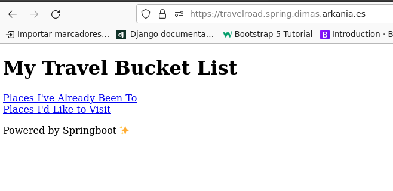
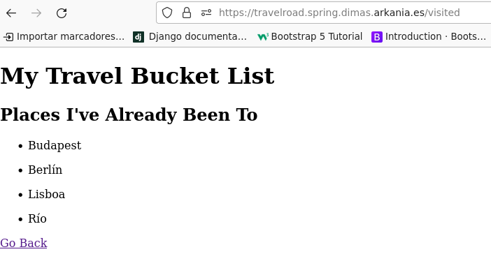
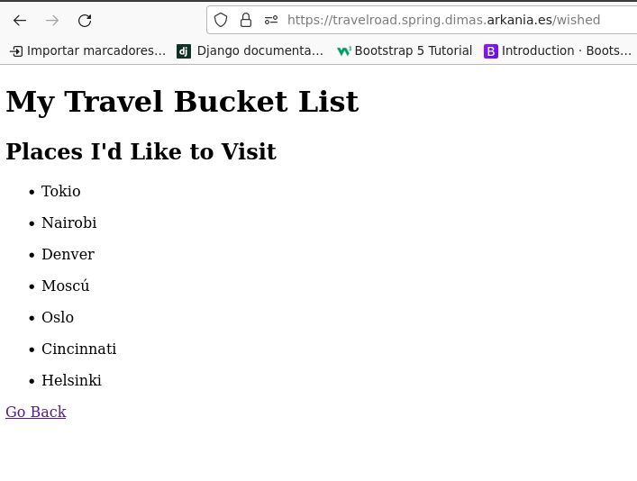

<center>

# TÍTULO DE LA PRÁCTICA


</center>

***Nombre:***
***Curso:*** 2º de Ciclo Superior de Desarrollo de Aplicaciones Web.

### ÍNDICE

+ [Introducción](#id1)
+ [Objetivos](#id2)
+ [Material empleado](#id3)
+ [Desarrollo](#id4)
+ [Conclusiones](#id5)


#### ***Introducción***. <a name="id1"></a>

Aquí explicamos brevemente la parte teórica que tiene que ver con la práctica que se va a realizar

#### ***Objetivos***. <a name="id2"></a>

Aquí explicamos los objetivos que se pretenden alcanzar al realizar la práctica.

#### ***Material empleado***. <a name="id3"></a>

Enumeramos el material empleado tanto hardware como software y las conficuraciones que hacemos (configuraciones de red por ejemplo) 

#### ***Desarrollo***. <a name="id4"></a>

##### Servidor de desarrollo

Para la realiazación de este proyecto es necesaria la instalación del JDK ( Java Development Kit ) ya que vamos a trabajar con Java.

Para ello podemos descargar OpenJDK con el siguiente comando:

```
curl -O --output-dir /tmp \
https://download.java.net/java/GA/jdk19.0.1/afdd2e245b014143b62ccb916125e3ce/10/GPL/openjdk-19.0.1_linux-x64_bin.tar.gz
```

Y descomprimimos: 

```
sudo tar -xzvf /tmp/openjdk-19.0.1_linux-x64_bin.tar.gz \
--one-top-level=/usr/lib/jvm
```

Una vez hecho esto realizamos las configuraciones pertinentes del JDK:

```
sudo nano /etc/profile.d/jdk_home.sh
```

Su contenido es el siguiente: 

```
#!/bin/sh
export JAVA_HOME=/usr/lib/jvm/jdk-19.0.1/
export PATH=$JAVA_HOME/bin:$PATH
```

Hecho esto toca actualizar las alternativas para los ejecutables:

```
pc17-dpl@a109pc17dpl:~$ sudo update-alternatives --install \
"/usr/bin/java" "java" "/usr/lib/jvm/jdk-19.0.1/bin/java" 0

pc17-dpl@a109pc17dpl:~$ sudo update-alternatives --install \
"/usr/bin/javac" "javac" "/usr/lib/jvm/jdk-19.0.1/bin/javac" 0

pc17-dpl@a109pc17dpl:~$ sudo update-alternatives --set java \
/usr/lib/jvm/jdk-19.0.1/bin/java

pc17-dpl@a109pc17dpl:~$ sudo update-alternatives --set javac \
/usr/lib/jvm/jdk-19.0.1/bin/javac
```

El siguiente paso en instalar SDKMAN, una herramienta para la gestión de versiones de kit de desarrollo.
Para ello es necesario tener instalado en primer lugar el paquete zip:

```
sudo apt install -y zip
```

Y ejecutamos el scrip de instalación: 

```
curl -s https://get.sdkman.io | bash
```

Y activamos el punto de entrada:

```
source "$HOME/.sdkman/bin/sdkman-init.sh"
```

Terminado los preparativos, el siguiente paso es instalar springboot:

```
sdk install springboot
```

Y maven para la gestión de dependencias:

```
sdk install maven
```

El siguiente paso sera la creación del proyecto en si mismo: 

```
spring init \
--build=maven \
--dependencies=web \
--group=edu.dpl \
--name=travelroad \
--description=TravelRoad \
travelroad
```

Hecho esto, configuramos la estrcutura del proyecto para cumplir con el objetivo de la aplicación:

```
pc17-dpl@a109pc17dpl:~/travelroad$ mkdir -p src/main/java/edu/dpl/travelroad/controllers
pc17-dpl@a109pc17dpl:~/travelroad$ touch src/main/java/edu/dpl/travelroad/controllers/HomeController.java

pc17-dpl@a109pc17dpl:~/travelroad$ mkdir -p src/main/java/edu/dpl/travelroad/models
pc17-dpl@a109pc17dpl:~/travelroad$ touch src/main/java/edu/dpl/travelroad/models/Place.java

pc17-dpl@a109pc17dpl:~/travelroad$ mkdir -p src/main/java/edu/dpl/travelroad/repositories
pc17-dpl@a109pc17dpl:~/travelroad$ touch src/main/java/edu/dpl/travelroad/repositories/PlaceRepository.java

pc17-dpl@a109pc17dpl:~/travelroad$ touch src/main/resources/templates/home.html
```

Configuramos el controlador:

```
pc17-dpl@a109pc17dpl:~/travelroad$ vi src/main/java/edu/dpl/travelroad/controllers/HomeController.java
```

```
package edu.dpl.travelroad.controllers;

import edu.dpl.travelroad.models.Place;
import edu.dpl.travelroad.repositories.PlaceRepository;
import org.springframework.beans.factory.annotation.Autowired;
import org.springframework.stereotype.Controller;
import org.springframework.ui.Model;
import org.springframework.web.bind.annotation.GetMapping;

@Controller
public class HomeController {
    private final PlaceRepository placeRepository;

    @Autowired
    public HomeController(PlaceRepository placeRepository) {
        this.placeRepository = placeRepository;
    }

    @GetMapping("/")
    public String home(Model model) {
        model.addAttribute("wished", placeRepository.findByVisited(false));
        model.addAttribute("visited", placeRepository.findByVisited(true));
        return "home";  // home.html
    }
}
```

Los modelos: 

```
pc17-dpl@a109pc17dpl:~/travelroad$ vi src/main/java/edu/dpl/travelroad/models/Place.java
```

```
package edu.dpl.travelroad.models;

import javax.persistence.Entity;
import javax.persistence.GeneratedValue;
import javax.persistence.GenerationType;
import javax.persistence.Id;
import javax.persistence.Table;

@Entity
@Table(name = "places")
public class Place {

    @Id
    @GeneratedValue(strategy = GenerationType.AUTO)
    private Long id;

    private String name;
    private Boolean visited;

    public Place() {
    }

    public Place(Long id, String name, Boolean visited) {

        this.id = id;
        this.name = name;
        this.visited = visited;
    }

    public Long getId() {
        return id;
    }

    public String getName() {
        return name;
    }

    public void setName(String name) {
        this.name = name;
    }

    public Boolean getVisited() {
        return visited;
    }

    public void setVisited(Boolean visited) {
        this.visited = visited;
    }
}
```

El repositorio: 

```
pc17-dpl@a109pc17dpl:~/travelroad$ vi src/main/java/edu/dpl/travelroad/repositories/PlaceRepository.java
```

```
package edu.dpl.travelroad.repositories;

import edu.dpl.travelroad.models.Place;

import java.util.List;
import org.springframework.data.repository.CrudRepository;
import org.springframework.stereotype.Repository;
import org.springframework.data.jpa.repository.Query;

@Repository
public interface PlaceRepository extends CrudRepository<Place, Long> {

    @Query("SELECT p FROM Place p WHERE p.visited = ?1")
    List<Place> findByVisited(Boolean visited);
}
```

Las plantillas ( donde utilizaremos el moto de plantillas Thymeleaf):

```
pc17-dpl@a109pc17dpl:~/travelroad$ vi src/main/resources/templates/home.html
```

```
<!DOCTYPE HTML>
<html>
<head>
    <title>My Travel Bucket List</title>
    <meta http-equiv="Content-Type" content="text/html; charset=UTF-8" />
</head>
<body>
    <h1>My Travel Bucket List</h1>
    <h2>Places I'd Like to Visit</h2>
    <ul th:each="place : ${wished}">
      <li th:text="${place.name}"></li>
    </ul>

    <h2>Places I've Already Been To</h2>
    <ul th:each="place : ${visited}">
      <li th:text="${place.name}"></li>
    </ul>
</body>
</html>
```

A continuación configuramos el fichero de dependencias para Maven:

```
<?xml version="1.0" encoding="UTF-8"?>
<project xmlns="http://maven.apache.org/POM/4.0.0" xmlns:xsi="http://www.w3.org/2001/XMLSchema-instance"
	xsi:schemaLocation="http://maven.apache.org/POM/4.0.0 https://maven.apache.org/xsd/maven-4.0.0.xsd">
	<modelVersion>4.0.0</modelVersion>
	<parent>
		<groupId>org.springframework.boot</groupId>
		<artifactId>spring-boot-starter-parent</artifactId>
		<version>2.7.5</version>
		<relativePath/> <!-- lookup parent from repository -->
	</parent>
	<groupId>edu.dpl</groupId>
	<artifactId>travelroad</artifactId>
	<version>0.0.1-SNAPSHOT</version>
	<name>travelroad</name>
	<description>TravelRoad</description>
	<properties>
		<java.version>19</java.version>
	</properties>
	<dependencies>
		<dependency>
			<groupId>org.springframework.boot</groupId>
			<artifactId>spring-boot-starter-web</artifactId>
		</dependency>

		<dependency>
			<groupId>org.springframework.boot</groupId>
			<artifactId>spring-boot-starter-test</artifactId>
			<scope>test</scope>
		</dependency>

		<dependency>
			<groupId>org.springframework.boot</groupId>
			<artifactId>spring-boot-starter-thymeleaf</artifactId>
		</dependency>

        <dependency>
			<groupId>org.springframework.boot</groupId>
			<artifactId>spring-boot-starter-data-jpa</artifactId>
		</dependency>

        <dependency>
          <groupId>org.postgresql</groupId>
          <artifactId>postgresql</artifactId>
          <scope>runtime</scope>
        </dependency>
	</dependencies>

	<build>
		<plugins>
			<plugin>
				<groupId>org.springframework.boot</groupId>
				<artifactId>spring-boot-maven-plugin</artifactId>
			</plugin>
		</plugins>
	</build>

</project>
```

Y añadimos las credenciales: 

```
pc17-dpl@a109pc17dpl:~/travelroad$ vi src/main/resources/application.properties
```

```
spring.datasource.url=jdbc:postgresql://localhost:5432/travelroad
spring.datasource.username=travelroad_user
spring.datasource.password=XXXXX
```

El último paso es el proceso de construcción.Para ello habrá que hacer una compilación del proyecto 

```
pc17-dpl@a109pc17dpl:~/travelroad$ ./mvnw compile
```

Y un empaquetado: 

```
pc17-dpl@a109pc17dpl:~/travelroad$ ./mvnw package
```

### Servidor de producción

Para la configuración en producción se deberá de crear un script para que realice los pasos del proceso de construcción una vez se suben nuevos cambios al repositorio remotodo por medio del deploy.sh. Para ello se crea el fichero run.sh con el siguiente contenido dentro de la carpeta del proyecto:

```
nano run.sh
```

Con el siguiente contenido:

```
#!/bin/bash

cd /home/dimas/travelroad_spring/travelroad

./mvnw package  # el empaquetado ya incluye la compilación

# ↓ Último fichero JAR generado
JAR=`ls target/*.jar -t | head -1`
/usr/bin/java -jar $JAR
```

Y le damos permisos de ejecución:

```
chmod +x run.sh
```

El siguiente paso es la creación de un fichero de servicio para gestionarlo mediante systemd:

```
mkdir -p ~/.config/systemd/user
nano ~/.config/systemd/user/travelroad.service
```

Con el siguiente contenido:

```
[Unit]
Description=Spring Boot TravelRoad

[Service]
Type=simple
StandardOutput=journal
ExecStart=/home/dimas/travelroad_spring/travelroad/run.sh

[Install]
WantedBy=default.target
```
Hecho esto, habilitamos el servicio para que este se arranque de manera automática:

```
systemctl --user enable travelroad.service
```

Iniciamos el servicio:

```
systemctl --user start travelroad.service
```

Y por último la configuración de nginx:

```
server {
    server_name travelroad;

    location / {
        proxy_pass http://localhost:8080;  # socket TCP
    }
}
```

Además, podemos crear un scipt de despliegue para, una vez hechos cambios en desarrollo, estos se despliguen directamente en producción:

```
#!/bin/bash

cd usr/share/nginx/travelroad_spring
sudo git add .
sudo git commit -m "Changes"
sudo git push

ssh dimas@dimas.arkania.es "
  cd /home/dimas/travelroad_spring
  git pull
  systemctl --user restart travelroad.service
"
```

#### Modificación del proyecto

Una vez terminada la configuración del proyecto en la parte de desarrollo y producción, el siguiente paso será modificar el proyecto en desarrollo. En el caso que nos ocupa se ha separado los lugares visitos y a visitar. Para ello simplemente ha sido necesario configurar el fichero HomeController.java ( el cual se encarga de gestionar las rutas y las variables que se le pasarán a esta ):

```
package edu.dpl.travelroad.controllers;

import edu.dpl.travelroad.models.Place;
import edu.dpl.travelroad.repositories.PlaceRepository;
import org.springframework.beans.factory.annotation.Autowired;
import org.springframework.stereotype.Controller;
import org.springframework.ui.Model;
import org.springframework.web.bind.annotation.GetMapping;

@Controller
public class HomeController {
    private final PlaceRepository placeRepository;

    @Autowired
    public HomeController(PlaceRepository placeRepository) {
        this.placeRepository = placeRepository;
    }

    @GetMapping("/")
    public String home(Model model) {
        model.addAttribute("wished", placeRepository.findByVisited(false));
        model.addAttribute("visited", placeRepository.findByVisited(true));
        return "home";  // home.html
    }

    @GetMapping("/visited")
    public String visited(Model model) {
        model.addAttribute("visited", placeRepository.findByVisited(true));
        return "visited"; // visited.html
    }

   @GetMapping("/wished")
   public String wished(Model model) {
        model.addAttribute("wished", placeRepository.findByVisited(false));
        return "wished"; // wished.html
   }
}
```
Y por otro lado se han creado dos plantillas nuevas y editado la plantilla home de la siguiente manera:
- home.html:

```
<!DOCTYPE HTML>
<html>
<head>
    <title>My Travel Bucket List</title>
    <meta http-equiv="Content-Type" content="text/html; charset=UTF-8" />
</head>
<body>
    <h1>My Travel Bucket List</h1>
    <a href="/visited">Places I've Already Been To</a>
    <br>
    <a href="/wished">Places I'd Like to Visit</a>
    <p>Powered by Springboot &#10024;</p>
</body>
</html>
```
- wished.html:

```
<!DOCTYPE HTML>
<html>
<head>
    <title>My Travel Bucket List</title>
    <meta http-equiv="Content-Type" content="text/html; charset=UTF-8" />
</head>
<body>
    <h1>My Travel Bucket List</h1>
    <h2>Places I'd Like to Visit</h2>
    <ul th:each="place : ${wished}">
      <li th:text="${place.name}"></li>
    </ul>
    <p><a href="/">Go Back</a></p>
</body>
</html>
```

- visited.html:

```
<!DOCTYPE HTML>
<html>
<head>
    <title>My Travel Bucket List</title>
    <meta http-equiv="Content-Type" content="text/html; charset=UTF-8" />
</head>
<body>
    <h1>My Travel Bucket List</h1>
    <h2>Places I've Already Been To</h2>
    <ul th:each="place : ${visited}">
      <li th:text="${place.name}"></li>
    </ul>
    <p><a href="/">Go Back</a></p>
    </body>
</html>
```
<br>
<center>
	

 
<br>


 
<br>


 
</center>
<br>
#### ***Conclusiones***. <a name="id5"></a>

En esta parte debemos exponer las conclusiones que sacamos del desarrollo de la prácica.

